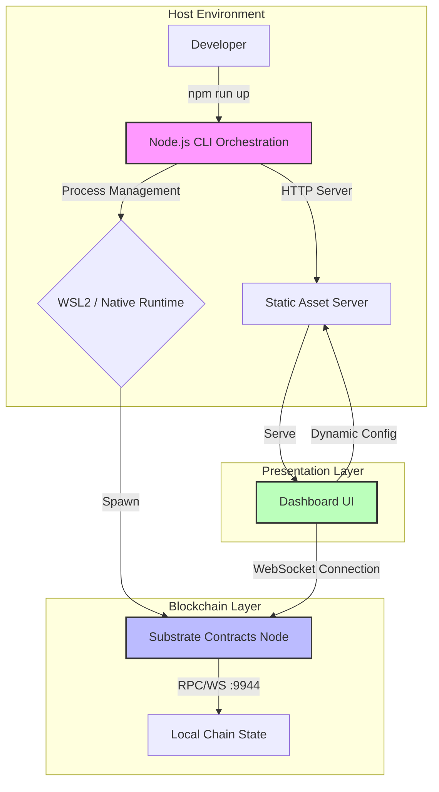
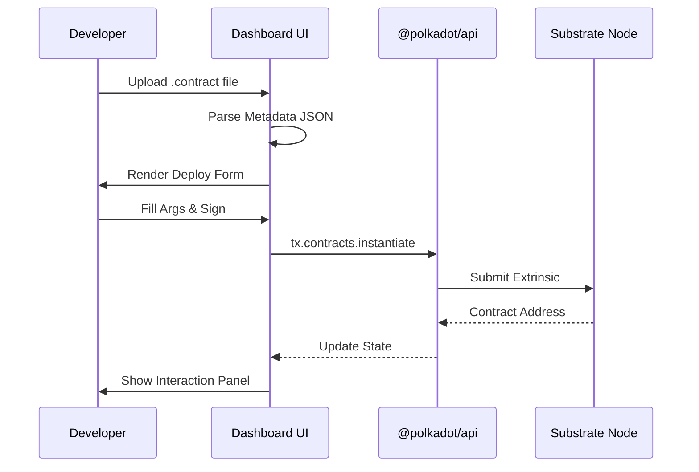

# Portaldot

**The fastest way to build, test, and deploy ink! smart contracts.**

Portaldot is a zero-friction development environment that eliminates the friction of Substrate blockchain development. No more wrestling with Rust toolchains, debugging cross-platform binary incompatibilities, or waiting hours for node compilation. Spin up a fully functional blockchain sandbox in seconds, deploy contracts with a single click, and iterate at the speed of thought.

## Why Portaldot?

Substrate development shouldn't require a PhD in systems programming. Portaldot strips away the complexity and gives you what actually matters:

*   **Instant Setup:** `npm install && npm run up`. That's it. The suite auto-downloads the correct node binary for your platform and handles all the networking magic.
*   **Cross-Platform by Design:** Runs natively on Linux/macOS and seamlessly bridges Windows via WSL2. One codebase, every developer.
*   **Live Contract Interaction:** Upload a compiled `.contract` file and interact with it immediately. No external tools, no context switching.
*   **Pre-Built Templates:** Seven production-ready ink! contracts (ERC-20, NFT, Escrow, Multi-Sig, Voting, Staking, Oracle) ready to copy, customize, and deploy.

## System Architecture

Portaldot is built on a decoupled architecture that separates orchestration, execution, and presentation. This ensures that each layer can be optimized independently while maintaining a cohesive developer experience.

### High-Level Overview



### Component Breakdown

#### 1. Orchestration Layer (`cli.js`)
The CLI is the brain of the operation. It uses Node.js `child_process` to manage the lifecycle of the Substrate node and the dashboard server.
*   **Binary Resolution:** Detects the host OS and architecture. If the binary is missing, it fetches the correct artifact from upstream releases.
*   **WSL Bridging:** On Windows, it translates local paths to WSL mount points (`/mnt/c/...`) and executes the Linux binary via `wsl -e`. It captures the WSL process PID to allow clean shutdowns from the host.
*   **Port Detection:** The node may fallback to a random port if `9944` is occupied. The CLI parses the node's stdout for the `Listening for new connections on...` message and passes the actual port to the dashboard server.

#### 2. Network Bridging & Dynamic Injection
WSL2 uses a virtualized network interface with an ephemeral IP address. Hardcoding `localhost` breaks connectivity between the Windows host browser and the WSL node.
*   **Detection:** The server executes a lightweight WSL command (`ip -4 addr show eth0`) to resolve the current virtual IP.
*   **Injection:** The server intercepts requests for `index.html` and injects the resolved WebSocket URL into the client script before serving. This ensures the dashboard always connects to the correct endpoint without manual configuration.

#### 3. Contract Deployment Flow
The dashboard integrates `@polkadot/api` to handle SCALE encoding and transaction signing directly in the browser.



### Technical Decisions & Trade-offs

| Decision | Rationale | Trade-off |
| :--- | :--- | :--- |
| **WSL2 Execution on Windows** | Substrate binaries are Linux-first. Building for Windows introduces massive toolchain debt. | Requires WSL2; adds slight overhead for path translation. |
| **Dynamic IP Injection** | WSL2 IPs change on every reboot. Static config is brittle. | Adds ~2s startup delay for IP detection. |
| **CDN-based Polkadot API** | Avoids bundling a 5MB+ library. Keeps the dashboard lightweight. | Requires internet access on first load; relies on CDN availability. |
| **JSON Metadata Parsing** | `.contract` files contain all type info needed for UI generation. | Large metadata files can slow down initial parsing. |

## Getting Started

```bash
npm install
npm run up
```

Your blockchain is live. Open `http://localhost:3000` and start building.

### Commands

| Command | Description |
|---------|-------------|
| `npm run up` | Launch node + dashboard |
| `npm run down` | Gracefully stop all services |
| `npm run clean` | Wipe chain state and restart fresh |
| `npm run status` | Inspect running services and endpoints |

## What's Next

Portaldot is actively evolving. Here's what's on the horizon:

*   **One-Click Contract Deployment:** Drag-and-drop `.contract` files directly into the dashboard. Auto-generated forms, gas estimation, and instant instantiation.
*   **Dockerized Execution:** Run the node in an isolated container. No WSL required on Windows, consistent environments across teams.
*   **Advanced Contract Debugging:** Step-through execution, storage inspection, and event replay for complex ink! logic.
*   **Multi-Network Support:** Switch between local dev, testnet, and custom chain specs without restarting.

## Join the Build

Portaldot is built for developers who refuse to let tooling slow them down. If you're shipping ink! contracts, this is your new baseline.

[Explore the templates](templates/) · [Read the architecture](structure.md) · [Contribute](https://github.com/AlphaTechini/Portaldot-Dev-Suite)
